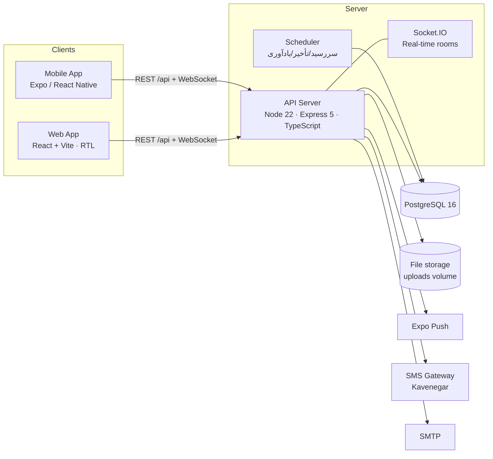

# ۱. معماری سامانه

## نمای کلی



| لایه | فناوری | توضیح |
|---|---|---|
| مدل دامنه و قواعد کسب‌وکار | `packages/shared` (TypeScript خالص) | State machine جلسه، محاسبه حد نصاب، شمارش آرا، ماتریس مجوزها، تقویم شمسی، برچسب‌های فارسی — مشترک بین API، وب و موبایل تا قواعد فقط یک‌جا تعریف شوند |
| API | Express 5، zod، pg، Socket.IO، pino | REST + رویدادهای زنده؛ اعتبارسنجی ورودی با zod؛ SQL صریح و تراکنشی |
| پایگاه داده | PostgreSQL 16 | Migration در `apps/api/src/db/migrations`؛ تریگرهای سطح DB برای Audit Log و قفل صورتجلسه |
| وب | React 19، React Router 7، Vite | RTL کامل، فونت وزیرمتن، تم روشن/تیره، Responsive |
| موبایل | Expo SDK 57، expo-router، SecureStore، Notifications، Calendar | ابزار عملیاتی زمان جلسه (Meeting Room) |

## ساختار مخزن

```
packages/shared     قواعد کسب‌وکار مشترک + تست واحد
apps/api            سرور API، migration، seed، تست یکپارچه/E2E، openapi.yaml
apps/web            وب‌اپلیکیشن مدیریتی و اتاق جلسه
apps/mobile         اپلیکیشن موبایل (Android/iOS)
docs/               مستندات فنی و محصولی
```

## Multi-Tenant

- هر جدول کسب‌وکار ستون `chamber_id` دارد (کلید مستأجر). اتاق‌های استانی در یک پلتفرم مشترک مدیریت می‌شوند.
- دسترسی در هر درخواست از روی سه منبع محاسبه می‌شود: نقش سیستمی (Super Admin / مدیر اتاق)، سمت فعال در کمیسیون، نقش در جلسه. منطق آن در `packages/shared/src/permissions.ts` و `apps/api/src/services/access.ts` است.
- منابعی که کاربر مجاز به دیدن آن‌ها نیست با **404** پاسخ داده می‌شوند (نه 403) تا وجود جلسه/کمیسیون سایر اتاق‌ها افشا نشود.
- زنجیره Audit Log به‌ازای هر اتاق جداگانه است.

## احراز هویت اشخاص (استعلام ثبت احوال)

تعریف اشخاص در کل سامانه (اعضا، مدیران اتاق، کارشناسان، مدعوین) از طریق سرویس استعلام هویت انجام می‌شود:

1. کاربر مجاز (مدیر اتاق یا رئیس/دبیر کمیسیون) کد ملی و تاریخ تولد شمسی را وارد می‌کند.
2. سرور، کد ملی را با الگوریتم رقم کنترل بررسی می‌کند. سپس سرویس `POST https://s.api.ir/api/sw1/PersonInfo` را با `{nationalCode, birthDate}` و توکن Bearer فراخوانی می‌کند.
3. نام، نام خانوادگی و نام پدر رسمی جایگزین ورود دستی می‌شود و شخص با برچسب «هویت تأییدشده» ثبت می‌شود. پاسخ سرویس برای ممیزی ذخیره می‌شود.
4. هر کد ملی در هر اتاق یک‌بار ثبت می‌شود. هر استعلام با نام کاربر استعلام‌کننده در رویدادنگاری ثبت می‌شود. تعداد استعلام برای هر کاربر محدود است (۳۰ استعلام در ۱۰ دقیقه).

توکن سرویس فقط در تنظیمات سرور (`IDENTITY_API_TOKEN`) نگهداری می‌شود و هرگز به مرورگر یا اپ موبایل نمی‌رسد.

| متغیر | توضیح |
|---|---|
| `IDENTITY_PROVIDER` | `sapi` (سرویس واقعی)، `mock` (داده آزمایشی)، `none` (غیرفعال؛ ورود دستی) |
| `IDENTITY_API_TOKEN` | توکن دریافتی از ارائه‌دهنده سرویس |
| `IDENTITY_API_URL` | پیش‌فرض `https://s.api.ir/api/sw1/PersonInfo` |
| `IDENTITY_REQUIRED` | `true` = ثبت شخص بدون استعلام موفق ممکن نیست |

## Real-time

Socket.IO روی همان سرور API (مسیر `/socket.io`) با احراز هویت JWT در handshake.

| Room | اعضا | رویدادها |
|---|---|---|
| `user:{id}` | خود کاربر | `notification` |
| `meeting:{id}` | همه کسانی که مجوز دیدن جلسه را دارند | `meeting.updated`, `quorum.updated` (خلاصه), `agenda.updated`, `comment.created`, `vote.opened`, `vote.progress` (فقط تعداد)، `vote.closed` |
| `meeting:{id}:officers` | رئیس، نایب‌رئیس، دبیر، مدیران | `attendance.updated` (لیست کامل + جزئیات نصاب)، `vote.closed` با نتیجه حتی وقتی نمایش نتیجه محدود است |

کلاینت‌ها پس از هر اتصال مجدد دوباره `meeting:join` می‌کنند و وضعیت را از REST بازخوانی می‌کنند؛ بنابراین قطع و وصل اینترنت موبایل باعث از دست رفتن وضعیت نمی‌شود. اعلام حضور در حالت آفلاین در صف می‌ماند و پس از اتصال ارسال می‌شود.

> برای اجرای چند نمونه (instance) از API، آداپتر Redis برای Socket.IO (`@socket.io/redis-adapter`) اضافه شود و Scheduler فقط روی یک نمونه فعال باشد (`SCHEDULER_ENABLED=false` روی بقیه).

## امنیت

| الزام سند | پیاده‌سازی |
|---|---|
| احراز هویت امن | JWT دسترسی کوتاه‌عمر (۱۵ دقیقه) + Refresh Token چرخشی ذخیره‌شده به‌صورت هش؛ استفاده مجدد از توکن چرخیده‌شده همه نشست‌های کاربر را باطل می‌کند. ساختار با OIDC سازگار است و در صورت نیاز می‌توان SSO سازمانی را جایگزین کرد |
| MFA | TOTP (RFC 6238) سازگار با Google/Microsoft Authenticator |
| RBAC/ABAC | ماتریس قابلیت‌ها بر اساس نقش سیستمی + سمت کمیسیون + نقش در جلسه + تنظیمات کمیسیون |
| Rate limiting | ورود/تمدید: ۲۰ درخواست در ۱۵ دقیقه؛ API عمومی: ۶۰۰ درخواست در دقیقه به‌ازای کاربر |
| کنترل نشست | ابطال همه نشست‌ها هنگام تغییر رمز یا غیرفعال‌سازی کاربر؛ ثبت دستگاه/IP در refresh token |
| رمزنگاری | TLS در لایه nginx/Load balancer؛ رمزهای عبور با bcrypt؛ توکن‌ها فقط به‌صورت هش ذخیره می‌شوند؛ رمزنگاری at-rest در سطح دیسک/دیتابیس مدیریت‌شده |
| Audit Log غیرقابل دستکاری | جدول append-only (تریگر مانع UPDATE/DELETE)، زنجیره هش SHA-256 به‌ازای هر اتاق، endpoint بررسی سلامت زنجیره |
| آپلود فایل | فهرست سفید نوع فایل، تطبیق پسوند و magic bytes، سقف حجم، نقطه اتصال اسکن بدافزار (ClamAV)، هش SHA-256، دانلود با `nosniff` |
| رأی مخفی | هویت رأی‌دهنده هرگز در API نتایج برنمی‌گردد؛ در Audit Log حفظ و فقط برای Super Admin قابل مشاهده است |
| Helmet / CORS | هدرهای امنیتی و فهرست مجاز Originها |

## الزامات غیرعملکردی

- **RTL و فارسی**: تمام UI راست‌به‌چپ، تاریخ‌ها شمسی (تبدیل بدون وابستگی به Intl تا روی Hermes هم کار کند)، ارقام فارسی، پیام‌های خطای API فارسی.
- **موبایل و RTL**: جهت چیدمان در استایل‌ها صریح (`row-reverse`, `textAlign: right`) تعریف شده و `forcesRTL` خاموش است؛ در نتیجه ظاهر اپ مستقل از زبان دستگاه کاربر یکسان است.
- **مقیاس‌پذیری**: سرور بی‌حالت (stateless) به‌جز Socket.IO که با آداپتر Redis افقی می‌شود؛ ایندکس‌ها روی کلیدهای مستأجر و زمان.
- **Pagination / Search / Filter**: همه فهرست‌ها `page`, `pageSize` (حداکثر ۱۰۰) و `q` دارند؛ جستجوی سراسری `/api/search`.
- **Export با کنترل مجوز**: CSV سازگار با Excel (BOM + خنثی‌سازی formula injection).
- **Monitoring و Logging**: لاگ JSON با pino، `x-request-id` برای Trace، `/health` برای probe، Healthcheck در Docker.
- **همزمانی**: قفل سطر جلسه/رأی‌گیری در تراکنش، قید یکتای `(vote_session_id, voter_id)` و `(meeting_id, user_id)` — تست‌های هم‌زمانی در `apps/api/test`.

## استقرار

`docker-compose.yml` شامل PostgreSQL، API و وب (nginx با پراکسی `/api` و WebSocket). متغیرهای محیطی در `apps/api/.env.example`. برای تولید:

- `JWT_SECRET` حداقل ۳۲ کاراکتر (در غیر این صورت سرور اجرا نمی‌شود).
- پشتیبان‌گیری: `pg_dump` روزانه + نگهداری volume فایل‌ها؛ برای DR، replica فقط‌خواندنی PostgreSQL و نسخه‌برداری از `uploads`.
- اپ موبایل: `EXPO_PUBLIC_API_URL` آدرس سرور تولید؛ ساخت با EAS (`eas build`)؛ برای Push، `projectId` پروژه EAS در `app.json → extra.eas.projectId`.
