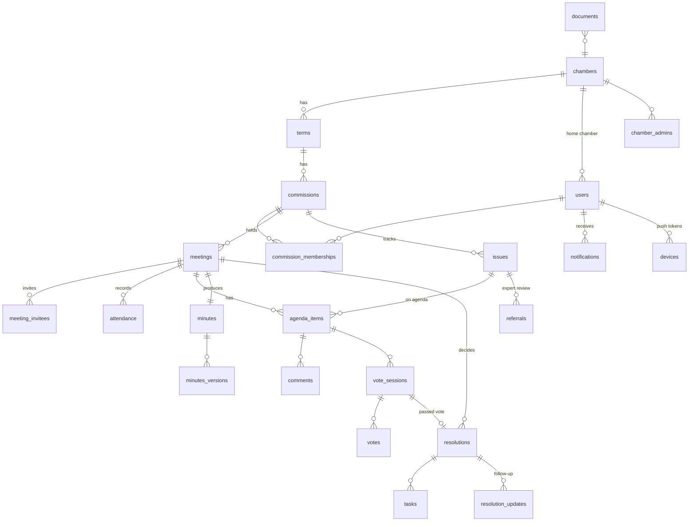

# ۲. پایگاه داده

Schema کامل: [`apps/api/src/db/migrations/001_init.sql`](../apps/api/src/db/migrations/001_init.sql). Migrationها هنگام شروع سرور (یا با `npm run db:migrate`) به‌ترتیب نام فایل و در تراکنش اجرا می‌شوند.

## نگاشت موجودیت‌های سند به جداول

| موجودیت سند | جدول | نکات |
|---|---|---|
| Chamber | `chambers` | `settings` (jsonb) برای تنظیمات اتاق |
| Term | `terms` | حداکثر یک دوره `active` در هر اتاق (ایندکس یکتای جزئی) |
| Commission | `commissions` | `settings` = CommissionSettings (نصاب، رأی، نمایش نتیجه…) |
| Person | `users` | شخص و حساب کاربری؛ شخص بدون رمز عبور (مثلاً مدعو) امکان ورود ندارد |
| CommissionMembership | `commission_memberships` | سابقه حذف نمی‌شود: تغییر سمت = پایان رکورد قبلی + رکورد جدید. در هر کمیسیون فقط یک رئیس/نایب‌رئیس/دبیر فعال |
| Meeting | `meetings` | `status` طبق state machine، `cancel_reason`، زمان/کاربر شروع و پایان |
| (دعوت‌شدگان) | `meeting_invitees` | Snapshot نقش و حق رأی در لحظه دعوت — تغییرات بعدی عضویت نصاب جلسات گذشته را تغییر نمی‌دهد |
| AgendaItem | `agenda_items` | وضعیت‌ها: pending/active/done/referred/removed؛ خلاصه مذاکرات، تصمیم، مصوبه پیشنهادی |
| Attendance | `attendance` | کلید `(meeting_id, user_id)` ⇒ ثبت مجدد رکورد تکراری نمی‌سازد؛ `checked_in_at`، روش، نماینده، `updated_by` |
| Vote | `vote_sessions` + `votes` | یکتایی `(vote_session_id, voter_id)`؛ حداکثر یک رأی‌گیری باز برای هر آیتم؛ `is_valid` برای اصلاح رسمی |
| Minutes | `minutes` + `minutes_versions` | نسخه‌بندی کامل؛ پس از تأیید با تریگر قفل می‌شود؛ `content_hash` و شماره صورتجلسه |
| Resolution | `resolutions` + `resolution_updates` | شماره `{کد کمیسیون}-{ترتیب}`؛ پیشرفت ۰ تا ۱۰۰؛ پرچم‌های ارسال یادآوری |
| Task | `tasks` | برای هر مصوبه خودکار ساخته می‌شود |
| مسائل و کارشناسی | `issues` + `referrals` | ارجاع به کارشناس و پاسخ او |
| Comment | `comments` | اظهارنظر روی آیتم دستور جلسه |
| Document | `documents` | اتصال به جلسه/آیتم/مصوبه/موضوع/کمیسیون؛ `sha256`، `scan_status` |
| Notification | `notifications` | کانال‌ها و وضعیت تحویل هر کانال (`delivery`) |
| AuditLog | `audit_logs` | append-only (تریگر)، `prev_hash`/`hash`، قبل/بعد، دلیل، IP و User-Agent |
| (نشست‌ها) | `refresh_tokens`, `devices` | توکن‌ها فقط هش؛ توکن Push دستگاه |

## داده آزمایشی (Seed)

`npm run db:seed` یک اتاق نمونه، دوره دهم فعال، دو کمیسیون (صادرات، انرژی)، رئیس/نایب‌رئیس/دبیر، ۶ عضو، کارشناس، مدعو، یک جلسه فردا با دستور جلسه و یک جلسه گذشته با مصوبات (یکی معوق) می‌سازد. رمز همه حساب‌ها: `Passw0rd!`.
