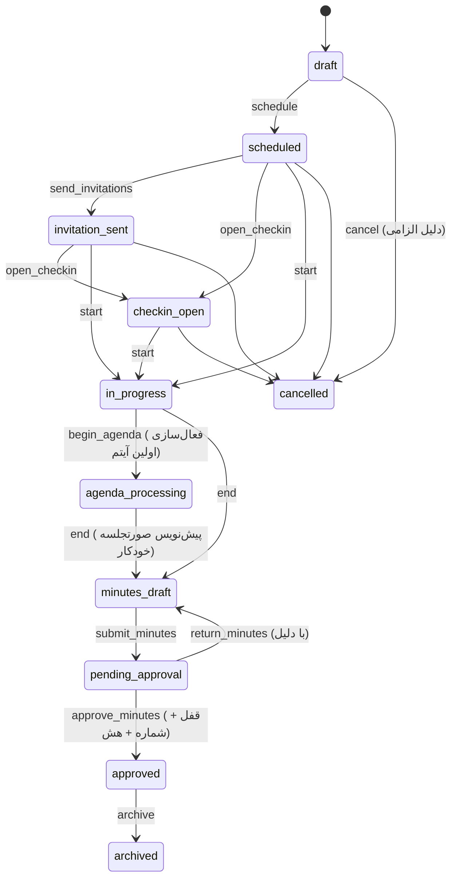

# ۵. چرخه عمر جلسه و قواعد کسب‌وکار

منبع: `packages/shared/src/meetingStateMachine.ts`. هر انتقال در Audit Log ثبت می‌شود.

## حضور و حد نصاب
- اعلام حضور فقط برای دعوت‌شدگان، فقط در `checkin_open` یا جلسه در حال برگزاری و فقط تا زمانی که دبیر آن را نبسته باشد.
- ثبت مجدد idempotent است: رکورد جدید ساخته نمی‌شود و زمان اولین ثبت حفظ می‌شود.
- اصلاح دستی فقط توسط دبیر/رئیس با دلیل الزامی؛ قبل و بعد در Audit Log.
- در پایان جلسه، افرادی که حضورشان مشخص نشده «غایب» ثبت می‌شوند.
- نصاب = تعداد اعضای **دارای حق رأی** حاضر؛ قواعد: نصف+۱، دو سوم، درصد، عدد ثابت؛ احتساب یا عدم احتساب حضور آنلاین و نماینده قابل تنظیم است.
- `requireQuorumToStart` و `requireQuorumForVoting` تنظیمات کمیسیون هستند؛ اگر جلسه بدون نصاب شروع شود به رئیس و دبیر اعلان «عدم حد نصاب» ارسال می‌شود.

## دستور جلسه و رأی‌گیری
- به‌طور پیش‌فرض فقط یک آیتم فعال است؛ فعال‌سازی آیتم بعدی، آیتم قبلی را خاتمه می‌دهد (اگر رأی‌گیری باز نداشته باشد).
- رأی‌گیری فقط روی آیتم فعال و توسط رئیس/دبیر شروع می‌شود؛ یک رأی‌گیری باز برای هر آیتم.
- فقط دعوت‌شدگان دارای حق رأی که حضورشان ثبت شده می‌توانند رأی دهند؛ رأی تکراری رد می‌شود (قید یکتا در DB، تست هم‌زمانی).
- پس از بسته شدن، تغییر رأی ممکن نیست مگر با «اصلاح رسمی» (ابطال رأی با دلیل توسط رئیس/مدیر اتاق، پیش از تأیید صورتجلسه).
- قواعد تصویب: اکثریت مطلق حاضرین (پیش‌فرض)، اکثریت آرای مأخوذه، موافق بیشتر از مخالف، دو سوم حاضرین.
- نتیجه خودکار به تصمیم آیتم و پیش‌نویس صورتجلسه متصل می‌شود؛ مصوبه فقط از رأی‌گیری تصویب‌شده قابل ایجاد است.
