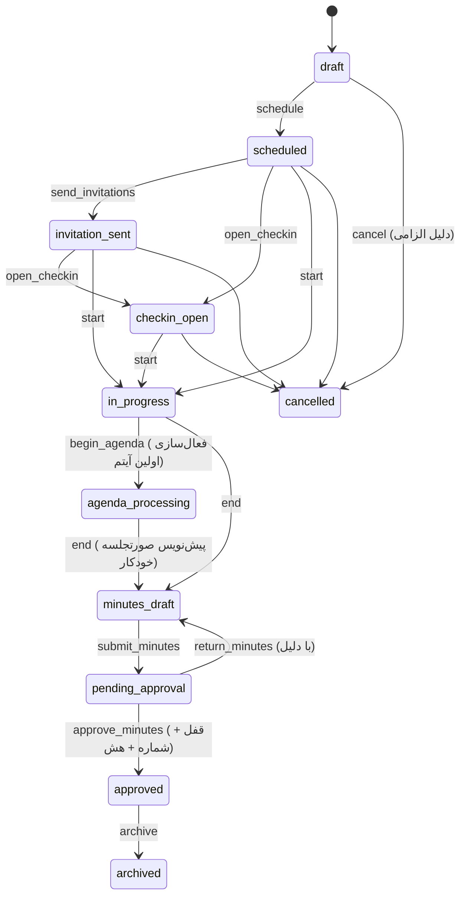

# ۵. چرخه عمر جلسه و قواعد کسب‌وکار

منبع: `packages/shared/src/meetingStateMachine.ts`. هر انتقال در Audit Log ثبت می‌شود.

## حضور و حد نصاب
- اعلام حضور فقط برای دعوت‌شدگان، فقط در `checkin_open` یا جلسه در حال برگزاری و فقط تا زمانی که دبیر آن را نبسته باشد.
- ثبت مجدد idempotent است: رکورد جدید ساخته نمی‌شود و زمان اولین ثبت حفظ می‌شود.
- اصلاح دستی فقط توسط دبیر/رئیس با دلیل الزامی؛ قبل و بعد در Audit Log.
- در پایان جلسه، افرادی که حضورشان مشخص نشده «غایب» ثبت می‌شوند.
- نصاب = تعداد اعضای **دارای حق رأی** حاضر؛ قواعد: نصف+۱، دو سوم، درصد، عدد ثابت؛ احتساب یا عدم احتساب حضور آنلاین و نماینده قابل تنظیم است.
- `requireQuorumToStart` و `requireQuorumForVoting` تنظیمات کمیسیون هستند؛ اگر جلسه بدون نصاب شروع شود به رئیس و دبیر اعلان «عدم حد نصاب» ارسال می‌شود.

## دستور جلسه و رأی‌گیری
- به‌طور پیش‌فرض فقط یک آیتم فعال است؛ فعال‌سازی آیتم بعدی، آیتم قبلی را خاتمه می‌دهد (اگر رأی‌گیری باز نداشته باشد).
- رأی‌گیری فقط روی آیتم فعال و توسط رئیس/دبیر شروع می‌شود؛ یک رأی‌گیری باز برای هر آیتم.
- فقط دعوت‌شدگان دارای حق رأی که حضورشان ثبت شده می‌توانند رأی دهند؛ رأی تکراری رد می‌شود (قید یکتا در DB، تست هم‌زمانی).
- پس از بسته شدن، تغییر رأی ممکن نیست مگر با «اصلاح رسمی» (ابطال رأی با دلیل توسط رئیس/مدیر اتاق، پیش از تأیید صورتجلسه).
- قواعد تصویب: اکثریت مطلق حاضرین (پیش‌فرض)، اکثریت آرای مأخوذه، موافق بیشتر از مخالف، دو سوم حاضرین.
- نتیجه خودکار به تصمیم آیتم و پیش‌نویس صورتجلسه متصل می‌شود؛ مصوبه فقط از رأی‌گیری تصویب‌شده قابل ایجاد است.

## نماینده (حضور به‌جای مدعو)

در روال اتاق‌ها مدعو معمولاً رئیس یا مدیرعامل یک سازمان یا شرکت است، ولی گاهی نماینده‌اش در جلسه حاضر می‌شود.

- **معرفی:** خود مدعو از وب یا اپ («معرفی نماینده»)، یا دبیر کمیسیون به‌جای او (مثلاً بر اساس نامه‌ای که به دبیرخانه رسیده)، نماینده را برای همان جلسه معرفی می‌کند.
  - هویت نماینده با کد ملی و تاریخ تولد از طریق سرویس استعلام ثبت می‌شود.
  - شماره موبایل نماینده برای ورود لازم است.
  - معرفی‌نامه رسمی قابل پیوست است. کمیسیون می‌تواند آن را الزامی کند (تنظیم «معرفی نماینده فقط با معرفی‌نامه»).
- **ورود نماینده:** اگر نماینده حساب کاربری نداشته باشد، یک رمز موقت ساخته می‌شود. این رمز فقط یک‌بار به معرفی‌کننده نمایش داده می‌شود تا به نماینده تحویل دهد.
- **دسترسی نماینده:** فقط به همان جلسه است: اعلان، دستور جلسه، مستندات، اعلام حضور و ثبت نظر. دسترسی‌های اجرایی هرگز به نماینده منتقل نمی‌شود. با لغو نماینده، دسترسی او فوراً قطع می‌شود.
- **حضور:** روی ردیف مدعو با وضعیت «نماینده عضو حاضر است» ثبت می‌شود. در حد نصاب طبق تنظیم «حضور نماینده در نصاب محاسبه شود» شمرده می‌شود. در صورتجلسه به شکل «فلانی به نمایندگی از …» می‌آید.
- **رأی:** اگر مدعو حق رأی داشته باشد، نماینده به نام او رأی می‌دهد (تنظیم «نماینده به‌جای مدعو رأی می‌دهد»، پیش‌فرض: روشن).
  - برای هر مدعو فقط یک رأی ثبت می‌شود.
  - در نتیجه رأی آشکار نوشته می‌شود «با رأی نماینده: …».
- **مسئولیت مصوبه:** مسئول اجرا **همیشه خود مدعو** (مدیر سازمان) است، نه نماینده. ابلاغ و پیگیری مصوبه به نام او انجام می‌شود و ارجاع داخلی کار خود سازمان و بیرون از سامانه است. در فرم ثبت مصوبه، مدعوین (مدیران سازمان‌ها) هم در فهرست «مسئول اجرا» هستند و نام سازمان خودکار در «دستگاه/مخاطب» قرار می‌گیرد.
- **رویدادنگاری:** معرفی و لغو نماینده ثبت می‌شود.
